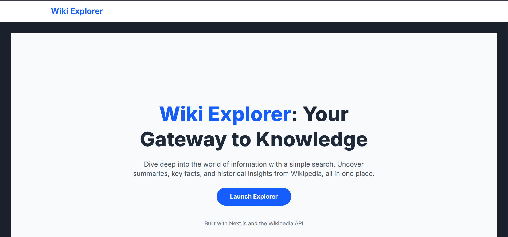
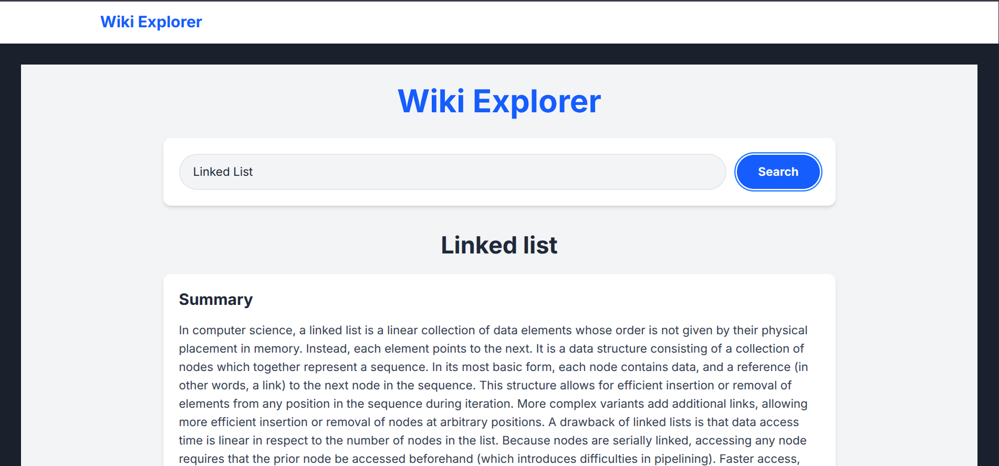

# Wiki Explorer
<p align="center">
  
  <br>
  <strong>Wiki Explorer - Cholo Shikhi</strong>
</p>

## Project Description

Wiki Explorer is a modern web application built with Next.js that allows users to search for any topic on Wikipedia and explore its content in an organized and user-friendly manner. The application fetches data from the Wikipedia API, presents it in a clean, responsive design, and offers an innovative AI-powered summarization feature for each section of a Wikipedia page.

## Features

-   **Instant Wikipedia Search:** Quickly search for any topic available on Wikipedia.
-   **Organized Content Display:** View Wikipedia page content broken down into digestible sections.
-   **AI-Powered Summarization:** Get concise summaries of individual sections using the Eden AI API, helping you grasp key information faster.
-   **Responsive Design:** Enjoy a seamless experience across various devices, from desktops to mobile phones.
-   **Modern UI:** A clean, intuitive, and aesthetically pleasing user interface built with Tailwind CSS.

## Demo


<p align="center">
  <b>Home Page</b>
</p>

---


<p align="center">
  <b>Result Page</b>
</p>


## Technologies Used

-   **Next.js:** React framework for production.
-   **React:** A JavaScript library for building user interfaces.
-   **Tailwind CSS:** A utility-first CSS framework for rapid UI development.
-   **Wikipedia API:** For fetching encyclopedic content.
-   **Eden AI:** For AI-powered text summarization.
-   **html-react-parser:** To parse HTML content into React components.

## Setup

Follow these steps to set up the project locally:

1.  **Clone the repository:**
    ```bash
    git clone https://github.com/your-username/wiki-explorer.git
    cd wiki-explorer
    ```

2.  **Install dependencies:**
    ```bash
    npm install
    ```

3.  **Set up Environment Variables:**
    Create a `.env.local` file in the root of your project and add your Eden AI API key:
    ```
    EDENAI_API_KEY=your_eden_ai_api_key
    ```
    You can obtain an API key from [Eden AI](https://www.edenai.co/).

4.  **Run the development server:**
    ```bash
    npm run dev
    ```

    Open [http://localhost:3000](http://localhost:3000) with your browser to see the result.

## Deployment

This project is configured for deployment on Vercel. Ensure you have the Vercel CLI installed and are logged in.

1.  **Install Vercel CLI (if you haven't already):**
    ```bash
    npm install -g vercel
    ```

2.  **Log in to Vercel:**
    ```bash
    vercel login
    ```

3.  **Deploy the project:**
    ```bash
    vercel
    ```
    Follow the prompts to link your project and deploy. Make sure to add your `EDENAI_API_KEY` as an environment variable in your Vercel project settings.
